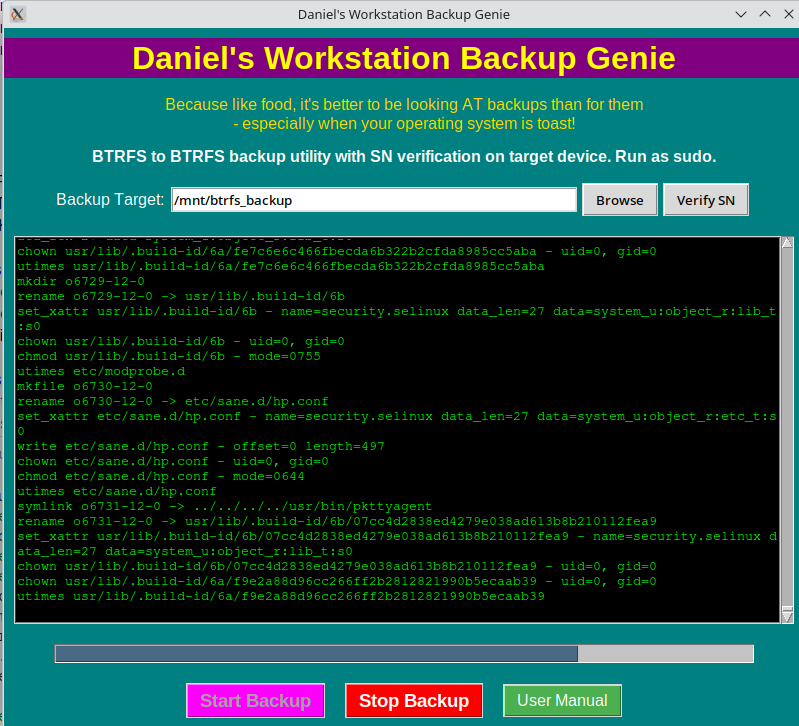
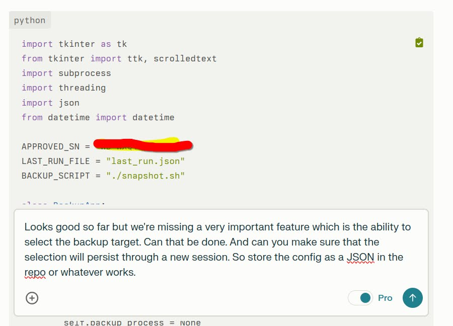

# Daniel's Workstation Backup Genie

## Description

Daniel's Workstation Backup Genie is an incremental BTRFS backup utility that creates snapshots and transfers them to another BTRFS filesystem. This tool is designed to provide efficient and reliable backups for BTRFS-based systems.

## Features

- Incremental BTRFS snapshots for efficient backups
- Hardcoded serial number verification for target device safety
- Real-time terminal output showing backup progress
- User-friendly GUI interface
- Automatic cleanup of old snapshots, keeping only the last three

## Screenshots (V1)

## The Making Of Daniel's Workstation Backup Genie!

## Usage

1. Configure the `APPROVED_SN` variable in the `snapshots.py` file to match your target device's serial number.
2. Run the application with sudo privileges:

3. Use the GUI to initiate and monitor backups.

## Configuration

Before running the utility, make sure to set the `APPROVED_SN` variable in `snapshots.py` to match your target backup device's serial number. This is a safety measure to prevent accidental writes to system drives.

## Development

This utility was developed through an innovative collaboration between a human developer (Daniel) and Claude, an AI assistant created by Anthropic. The development process involved iterative prompting and debugging, with Claude generating the code based on Daniel's requirements and feedback.

## Planned Features for V2

- Improved serial number matching
- Configurable serial number whitelist
- Two-stage snapshots with secondary push to B2 cloud storage
- Configurable backup parameters
- Additional retro-style illustrations to enhance the nostalgic user experience

## Contributing

Contributions are welcome! Please feel free to submit a Pull Request.

## License

[Specify your chosen license here]

## Acknowledgements

- Created by Daniel in collaboration with Claude, an AI assistant by Anthropic
- BTRFS developers and community

---

*Note: This README was generated by Claude, an AI assistant, based on project specifications and feature descriptions provided by the human developer. The AI assisted in organizing and formatting the content according to common GitHub README conventions.*